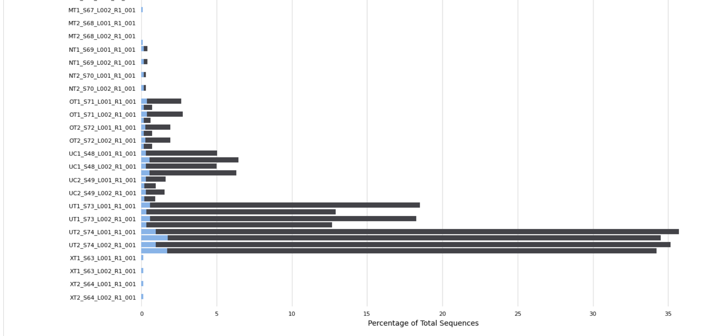

# Quality Control of RNA-seq data

Same as with metagenomic data, there are some preprocessing steps to RNA-seq data. For microbial samples we have to trim adapters, filter low quality and short reads and remove rRNA sequences.

## Generate report

Requires  
[FastQC](https://www.bioinformatics.babraham.ac.uk/projects/fastqc/)  
[MultiQC](https://github.com/ewels/MultiQC)

```bash
conda create -n fastqc

conda install -c bioconda fastqc
conda install -c bioconda multiqc
```

Use *de facto* fastqc, same as what is used for metagenomic data. MultiQC summarize all the FastQC reports into one neat HTML (a god sent for large sample numbers)

```bash
#!/bin/bash
#SBATCH --job-name=fastqc      # Job name
#SBATCH --nodes=1                    # Run all processes on a single node
#SBATCH --ntasks=1                   # Run a single task
#SBATCH --cpus-per-task=30            # Number of CPU cores per task
#SBATCH --mem=50G                    # Job memory request
#SBATCH --time=10:00:00              # Time limit hrs:min:sec
#SBATCH --output=fastqc%j.log     # Standard output and error log
pwd; hostname; date

source ~/miniconda3/etc/profile.d/conda.sh

conda activate fastqc

fastqc -o ./ -t 30 ../raw_fastq/*.fastq.gz

multiqc -o ./ -n rawReads ./
```

### Report results

With RNA-seq data, you can expect some parameters to fail:  

- per-base sequence content
- per-sequence GC content 
- Sequence duplication level
- Overrepresented sequences

from [this stack question](https://bioinformatics.stackexchange.com/questions/8983/what-are-the-right-parameters-to-trim-a-small-rna-transcriptome-with-trimmomatic)

It matters more if all the samples follow the same pattern or not. In my case, I have some samples with a lot more overrepresentated sequences.... and some without. Hopefully this goes away with rRNA removal



## Removal of partial adapters and quality trimming

***Do this step before rRNA removal so that all produced reads are good quality***

Can use Trimmomatic (standard) but I opted for bbduk - same as metagenomes but with different parameters. FastQC did not report ny adapters so I skipped the adapter trimming step and only trimmed the last base and did quality filtering with a minimum read length of 10 and quality of 15. 

```bash
#!/bin/bash
#SBATCH --job-name=bbduk      # Job name
#SBATCH --nodes=1                    # Run all processes on a single node
#SBATCH --ntasks=1                   # Run a single task
#SBATCH --cpus-per-task=30            # Number of CPU cores per task
#SBATCH --mem=50G                    # Job memory request
#SBATCH --time=10:00:00              # Time limit hrs:min:sec
#SBATCH --output=bbduk%j.log     # Standard output and error log
pwd; hostname; date

#source ~/miniconda3/etc/profile.d/conda.sh

#conda activate trimmomatic

for fn in ../raw_fastq/*.fastq.gz;
do
    base="${fn:0:-16}"
#trim off last base (round to 50bp)
    bbduk.sh in=${base}_R1_001.fastq.gz in2=${base}_R2_001.fastq.gz \
        out=${base}_R1_001.lastbase_rm.fastq.gz out2=${base}_R2_001.lastbase_rm.fastq.gz ftm=5

#quality filtering (for small RNA, minimum read length of 10 and min quality of 15)
    bbduk.sh in=${base}_R1_001.lastbase_rm.fastq.gz in2=${base}_R2_001.lastbase_rm.fastq.gz \
        out=${base}_R1_001.qc.fastq.gz out2=${base}_R2_001.qc.fastq.gz \
        qtrim=rl trimq=15 minlength=10
done
```

## Removal of rRNA sequences

Requires [SortMeRNA](https://github.com/sortmerna/sortmerna)

```bash
conda create -n sortmerna
conda activate sortmerna
conda install sortmerna
```


We only want mRNA for the mapping. SMR will take 22h for 174 fastq files with ~2M reads each so I split my fastq files into separate directories and ran 4 parallel slum scripts

```bash
i=0; for f in *; do d=dir_$(printf %03d $((i/44+1))); mkdir -p $d; mv "$f" $d; let i++; done
```

```bash
#!/bin/bash
#SBATCH --job-name=sortmerna      # Job name
#SBATCH --nodes=1                    # Run all processes on a single node
#SBATCH --ntasks=1                   # Run a single task
#SBATCH --cpus-per-task=40            # Number of CPU cores per task
#SBATCH --mem=50G                    # Job memory request
#SBATCH --time=48:00:00              # Time limit hrs:min:sec
#SBATCH --output=sortmerna%j.log     # Standard output and error log
#SBATCH --mail-type=END
pwd; hostname; date

source ~/miniconda3/etc/profile.d/conda.sh

conda activate sortmerna

for fn in ../all_fastq_files/qc_reads/*.qc.fastq.gz;
do
   base="${fn:0:-19}"
   newname=$(basename $fn .qc.fastq)
   sample="${newname:0:-19}"
   sortmerna --ref /work/ebg_lab/referenceDatabases/sortmerna_db/smr_v4.3_default_db.fasta \
       --workdir ./sortmerna/ \
       --reads ${base}_R1_001.qc.fastq.gz --reads ${base}_R2_001.qc.fastq.gz \
       --aligned ../all_fastq_files/rRNA_reads/${sample}_rRNA_reads.qc \
       --other ../all_fastq_files/non_rRNA_reads/${sample}_non_rRNA_reads.qc \
       --sam --SQ --log --fastx --threads 40 --paired_in
   rm -r ./sortmerna/kvdb/
done
```

And to run it:

```bash
sbatch sortmerna.sh ## --mail-user [email]
```

Move logs and sam files into their own directories from the rRNA reads output

```bash
cd ../all_fastq_files/rRNA_reads

mv *.log ../sortmerna_logs/

mv *.sam.gz ../sortmerna_sams/
```

## Run FastQC again

```bash
source ~/miniconda3/etc/profile.d/conda.sh

conda activate fastqc

fastqc -o ./fastqc_QCed -t 30 ../all_fastq_files/qc_reads/*.fastq.gz

fastqc -o ./fastqc_QCed_non_rRNA -t 30 ../all_fastq_files/non_rRNA_reads/*.fq.gz

multiqc -o ./fastqc_QCed -n QCed_reads ./fastqc_QCed

multiqc -o ./fastqc_QCed_non_rRNA -n QCed_non_rRNA_reads ./fastqc_QCed_non_rRNA
```

Check if any quality has improved and adapters have been trimmed if necessary. In my case, Don't have any more problems with overrepresented sequences in any samples.

Concatenate reads by sample and move into their own dir

```bash
for fn in ./*.fq.gz; do sample="${fn:0:-29}"; cat ${sample}_L001_non_rRNA_reads.qc.fq.gz ${sample}_L002_non_rRNA_reads.qc.fq.gz > ${sample}_CAT_non_rRNA_reads.qc.fq.gz;echo ${sample}_CAT_non_rRNA_reads.qc.fq.gz; done

mkdir concatenated

mv *CAT*.gz concatenated/
```

**Now `/work/ebg_lab/eb/Varada/Cyano_RNASeq/all_fastq_files/non_rRNA_reads/concatenated` folder contains the read files I use for mapping**

Can pull some summary stats on the quality control process from the logs and then just manipulate in Excel

```bash
cd sortmerna_logs/

#to look
grep "passing" *.log | less

#to count the reads and % reads that were filtered as rRNA
grep "passing" *.log > rRNA_reads_stats.txt

#to count the reads and % reads that were filtered as non_rRNA
grep "failing" *.log > non_rRNA_reads_stats.txt
```


These samples are ordered by a time-series - looks like there was more rRNA in the samples towards the end of the time-series

