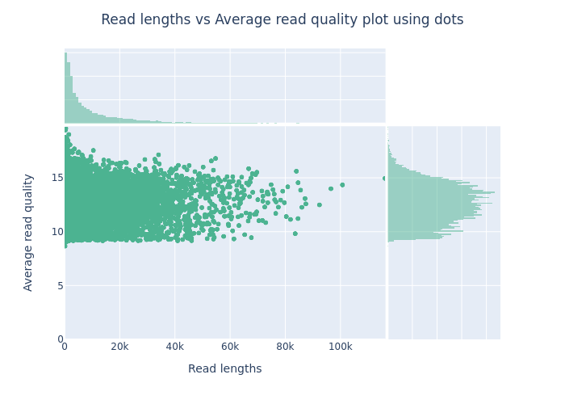

# Quality Control
Nanopore does it's own QC for the reads. Ignore the failed reads. fast5 format has additional information about the sequenced reads but you can use fastq for this step.

The "sequencing summary" file has information about each sequence and also has mean qscore: quality score

```bash
#Concatenate all your "pass" reads into one giant fastq file
cat ./fastq_pass/*.fastq.gz > all_passed_reads.fastq.gz
```

The Guppy basecaller does quality control and demultiplexing for us. This is extra.

[Porechop](https://github.com/rrwick/Porechop) 0.2.41 with default settings can be used for adapter trimming. Can be used on barcoded reads for demultiplexing (separating based on barcodes) and adapter trimming. Porechop is no longer supported but there isn't anything else to do this job. There's several deficiencies with Porechop (read on Github)


```bash
#to download, I used conda
conda create -n porechop
conda activate porechop
conda install -c bioconda porechop

#for porechop help
porechop -h

#to run porechop
porechop -i all_passed_reads.fastq.gz -o all_passed_reads_trimmed.fastq.gz -t 12
```
Before filtering reads by quality or length, or before assembly, it can be handy to know some statistics about your dataset. You can get a lot of information from MinKnow as is but here I used [Nanoplot](https://github.com/wdecoster/NanoPlot) to generate plots

```bash
#To download
conda install -c bioconda nanoplot

#to run
NanoPlot -t 30 --fastq all_reads_trimmed.fastq.gz --plots dot --legacy hex
```
Below is an example of the types of plots you might get. Something like this is important to look at so that you know approximately data is going to be lost when you filter by read quality or length.


Nanoplot also generates useful statistics like this:

|General summary:|   |
|---|---|
|Mean read length:|10,361.3|
|Mean read quality:|12.6|
|Median read length:|               5,191.0|
|Median read quality:|                 12.6|
|Number of reads:|                566,320.0|
|Read length N50:|                 22,240.0|
|STDEV read length:|               12,783.0|
|Total bases:|              5,867,821,618.0|


For filtering reads above a length or quality, use [Nanofilt](https://github.com/wdecoster/nanofilt) 

```bash
#To download, I used conda
conda install -c bioconda nanofilt

#To only include reads above quality 10
gunzip -c all_reads_trimmed.fastq.gz | NanoFilt -q 10 | gzip > all_reads_trimmed_HQ.fastq.gz
```

